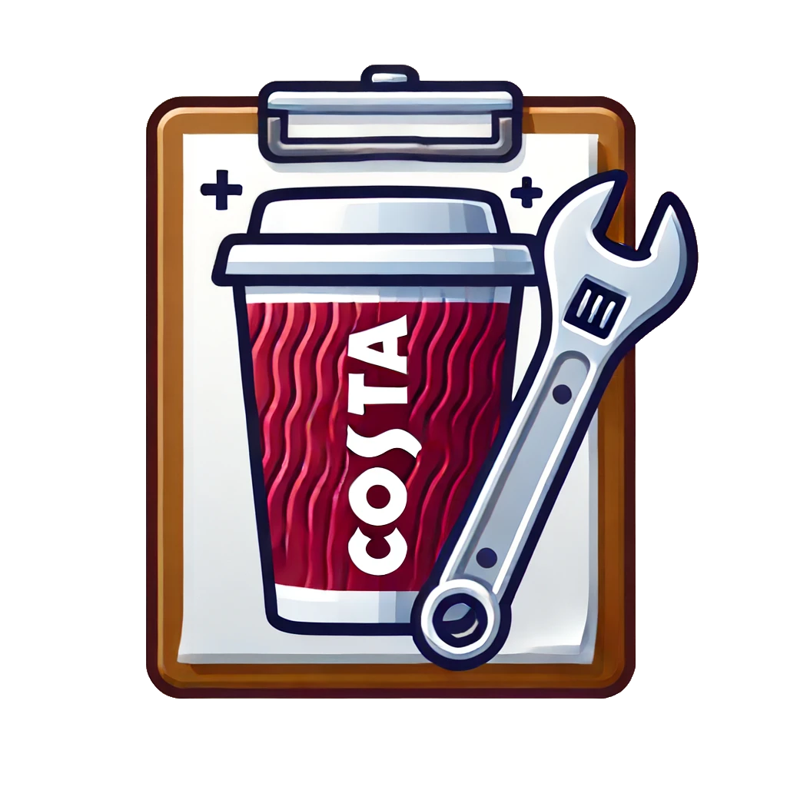

# Costa FSE Toolbox



A comprehensive mobile application for Costa Coffee field service engineers (FSEs) to streamline their daily operations. The application integrates multiple tools including a water filter recommendation system, machine information repository, technical document access, and maintenance guides.

## Features

### Water Filter Finder
- Analyzes water parameters (temporary hardness, total hardness, cups per day)
- Recommends the appropriate filter type (Fresh, Standard, Finest)
- Calculates optimal filter size (C300, C500, C1100) and bypass settings
- Displays filter capacity and installation instructions

### Machine Information
- Complete catalog of Costa Coffee machines
- Technical specifications and detailed parameters
- Maintenance procedures with step-by-step guides
- Troubleshooting guides for common issues
- Parts diagrams with component information

### Document Repository
- Technical manuals, guides, and bulletins
- Searchable and filterable document library
- Offline access to downloaded documents
- Document categorization by machine and type

### User Experience
- Secure login system for field service engineers
- Favorites system for quick access to frequently used machines
- Dashboard with recent updates and notifications
- Consistent Costa Coffee branding and styling

## Technical Information

### State Management
The app uses Riverpod 2.6.1 for state management, providing several advantages:
- Better testability with proper dependency injection
- Code generation for boilerplate reduction
- Family providers for parameterized access
- Clear separation of concerns with state/notifier/provider pattern

### Development Setup
```bash
# Install dependencies
flutter pub get

# Generate Riverpod code
flutter pub run build_runner build --delete-conflicting-outputs

# Run the application
flutter run

# Run linter
flutter analyze

# Run tests
flutter test
```

### Project Structure
- `lib/screens`: Main application screens
- `lib/widgets`: Reusable UI components
- `lib/models`: Data models
- `lib/providers`: Legacy Provider-based state management
- `lib/riverpod`: Riverpod-based state management
  - `states`: State classes defining application state
  - `notifiers`: Notifiers that manipulate state
  - `providers`: Provider definitions for consuming state
- `lib/services`: Business logic and external services
- `lib/constants.dart`: Styling constants and theme definitions

### Code Style
This project follows the official Flutter style guide with additional conventions:
- Named parameters for widgets and functions
- CamelCase for variables/methods, PascalCase for classes
- Extract reusable widgets into separate files
- Keep UI and business logic separate
- Include descriptive comments for complex logic

## Recent Updates
See the [CHANGELOG.md](CHANGELOG.md) for a detailed list of changes.

### Latest Developments
- Migrated from Provider to Riverpod 2.6.1 for improved state management
- Added code generation support with riverpod_generator
- Implemented proper separation of state, notifiers, and providers

## Future Development
See [FUTURE.md](FUTURE.md) for planned feature enhancements and improvements.

## Contributing
1. Follow the coding style guidelines in [CLAUDE.md](CLAUDE.md)
2. Include unit tests for new functionality
3. Ensure all tests pass before submitting changes
4. Update the documentation as needed

## License
This project is proprietary and confidential to Costa Coffee Ltd.
All rights reserved.